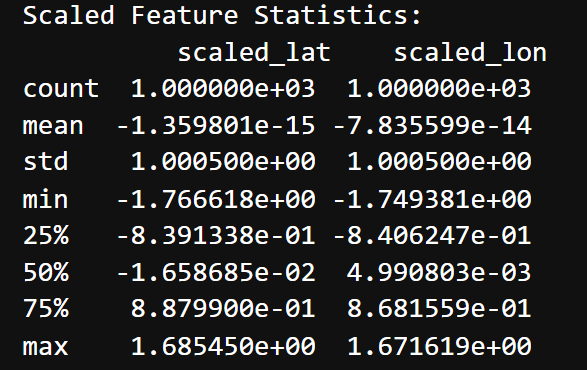

# Optimizing Public Transport Routes Using K-Means Clustering  

🚀 Live Demo: https://plp-clustering-web-app.onrender.com/

## 🚀 Project Overview  
This project applies **K-Means clustering** to analyze **Nairobi taxi trip data**, identifying **optimal transport pickup zones**. The goal is to enhance **public transport accessibility** and **support sustainable urban mobility (SDG 11).**  

## 📂 Dataset  
- **Source:** `nairobi_taxi_trips.csv` (Real-world taxi trip records)  
- **Key Features:**  
  - `pickup_lat` – Latitude of pickup location  
  - `pickup_lon` – Longitude of pickup location  

## 🔍 Workflow & Methodology  

### 1️⃣ Data Collection & Initial Cleaning  
✅ Load dataset and extract **pickup latitude & longitude**.  
✅ Remove **missing values**, filter out **(0,0) erroneous entries**, and keep data **within Nairobi’s city boundaries**.  

**Cleaned Dataset Preview:**  
  

### 2️⃣ Data Preprocessing & Feature Scaling  
✅ Apply `StandardScaler` to **normalize** latitude & longitude for clustering.  

**Scaled Dataset Statistics:**  
 

### 3️⃣ K-Means Clustering Implementation  
✅ Set `num_clusters = 6` to segment **transport pickup zones**.  
✅ Train the **K-Means model** on scaled data.  
✅ Extract **cluster centers**, representing **ideal transport hubs**.  

**Scatter Plot with Clusters:**  
  

### 4️⃣ Evaluation Metrics  
✅ **Boxplots:** Detect anomalies in latitude & longitude distribution.  

**Boxplot of Latitude:**  
  

**Boxplot of Longitude:**  
  

✅ **Heatmap Analysis:** Identify high-density taxi pickup areas.  

**Density Heatmap of Pickup Locations:**  
  

✅ **Pairplot:** Visualize feature relationships in location data.  

**Pairplot of Latitude and Longitude:**  
  

✅ **Cluster Distribution Plot:** Ensures transport demand is balanced across clusters.  

**Cluster Size Distribution:**  
  

## 🔍 Ethical Reflection  

### How Might Bias in the Data Affect Outcomes?  
✅ **Geographical Bias:** If the dataset overrepresents **high-traffic urban areas**, clustering may **neglect underserved regions** where transport accessibility is lower.  
✅ **Time-Based Bias:** If data collection mostly occurred during **rush hours**, it may misrepresent **off-peak transport demand**, leading to **ineffective service distribution**.  
✅ **User Demographic Bias:** Since ride-hailing services are used predominantly by **middle- and upper-income groups**, the clustering model may not reflect the **needs of lower-income commuters** relying on informal transport.  

### How Does the Solution Promote Fairness and Sustainability?  
✅ **Equitable Transport Planning:** By identifying **high-demand pickup zones**, urban planners can **optimize routes** to ensure **fair transport access for all areas**.  
✅ **Reduced Congestion & Emissions:** Well-clustered transport hubs **improve route efficiency**, lowering **traffic congestion and carbon footprint**.  
✅ **Improved Public Mobility:** The results can be used to **enhance matatu and bus networks**, benefiting **commuters across income levels**.  

